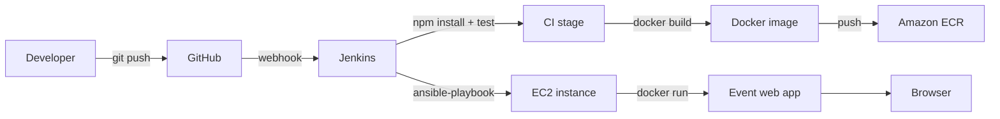

# Event Booking and Management System (AWS + CI/CD)

## 1) Problem Statement & Objectives
Build a full-stack event booking and management web app with a DevOps CI/CD pipeline. The system should allow admins to create events and users to book seats, while a Jenkins pipeline builds, containerizes, and deploys the app to AWS EC2.

## 2) Architecture Understanding (Workflow and Tool Integration)
**Workflow summary**
1. Developer pushes code to GitHub.
2. Jenkins checks out the repo, installs dependencies, runs tests, and builds a Docker image.
3. Jenkins pushes the image to Amazon ECR (container registry).
4. Jenkins triggers Ansible to deploy the image to an EC2 instance.
5. The EC2 host runs the container, exposes the app, and serves the UI.

**Key integrations**
- GitHub: source control and webhook trigger for Jenkins.
- Jenkins: CI/CD orchestration.
- Docker: container build and runtime.
- AWS ECR: image registry for EC2 deployments.
- AWS EC2: application host.
- Ansible: remote provisioning and deployment automation.

Mermaid diagram (optional in Markdown renderers that support it):



## 3) DevOps Tool Installation & Setup
### GitHub
- Create a new repository and push this code.
- Add a webhook in GitHub pointing to your Jenkins URL (for example, `http://JENKINS_HOST:8080/github-webhook/`).

### Jenkins
- Install Jenkins (native or Docker). Suggested plugins:
  - Git
  - Pipeline
  - Docker Pipeline
  - NodeJS (optional if you want Jenkins-managed Node)
- Configure credentials:
  - GitHub access token or SSH key.
  - AWS credentials (Access Key and Secret) or an IAM role on the Jenkins host.

### Docker
- Install Docker on the Jenkins host and on the EC2 instance.
- Verify with `docker version`.

### AWS CLI
- Install AWS CLI on the Jenkins host.
- Run `aws configure` or use IAM roles.
- Create an ECR repository named `event-management-webapp`.

### Ansible
- Install Ansible on the Jenkins host.
- Install Docker collection: `ansible-galaxy collection install community.docker`.
- Update `ansible/inventory.ini` with your EC2 public IP and key.

## 4) Pipeline Creation (Jenkins)
- Use the Jenkinsfile in the repo root.
- Configure environment variables:
  - `REGISTRY`: your ECR registry URL (example: `123456789012.dkr.ecr.ap-south-1.amazonaws.com`).
  - `AWS_REGION`: your AWS region.
  - `DEPLOY_HOST`: optional; used to enable the Ansible stage.
- If Jenkins runs on Windows, replace `sh` steps with `bat`.

## 5) Containerization
### Local run (Node)
```
npm install
npm start
```

### Local run (Docker)
```
docker build -t event-management-webapp:latest .
docker run -p 3000:3000 event-management-webapp:latest
```

## 6) AWS Planning (Deployment Strategy and Service Selection)
**Core services**
- EC2: hosts the app container.
- ECR: stores Docker images.
- IAM: least-privilege access for Jenkins and EC2.
- VPC + Security Groups: restrict inbound traffic to ports 80/443.

**Suggested deployment strategy**
1. Use a small EC2 instance (t3.micro) for dev/testing.
2. Configure a security group to allow HTTP (80) and SSH (22).
3. Attach an IAM role to EC2 with permission to pull from ECR.
4. Use Jenkins to push a new image and run Ansible for each release.
5. For production, place an Application Load Balancer in front of EC2 and enable HTTPS.

**Future upgrades**
- RDS for persistent event data.
- CloudWatch logs for container logs.
- Auto Scaling Group for high availability.

## App Endpoints
- `GET /api/health`
- `GET /api/events`
- `POST /api/events`
- `POST /api/events/:id/book`
- `DELETE /api/events/:id`

## Project Structure
- `server.js` - Node.js API and static file server.
- `public/` - UI assets.
- `Jenkinsfile` - CI/CD pipeline.
- `Dockerfile` - Container build.
- `ansible/` - Deployment automation.
